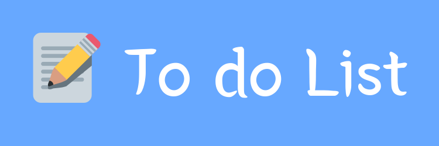

# Visit and use the To-Do list below!
[](https://redocamai.github.io/To-do-List/)

# Version


# Description
Do you often feel drained of, especially in the mid-day? Do you find yourself missing deadlines? Or do you forget something important, so that people have to chase you to get work done?

If this is what you feel like, most often, then all of these are the symptoms of NOT having a To-do List.
This To-do list is developed to wipe out those symptoms. Its interactive interface will alert you for approaching dues, sort, and even prioritize your tasks, as you add them along with the due date.

# Tech Stack
 * **HTML**
 * **CSS**
 * **Boostrap**
 * **Javascript**

# Features
  * Add Title, Description, and due date of the task in your TODOs. 
  * TODOs with past due dates **Cannot** be added.
  * A Calendar is present to help you with the due date.
  * There can be **No Task** without *title*, and *due date*.
  * A window contains *Description* and *Delete* option for a task, which pops up when clicked on it. Making it easier for the user to read the description for each task. 
  * The items added in the list can be prioritized by drag and drop feature.
  * Reminds you of the approaching dues by filling an item with a perticular color, here Red, Orange and Yellow.

# How to Use

## Add a task


## Other features


## Responsiveness


## Or access the full walk through video below
[](https://youtu.be/LCh34DR3Fjk)

# What type of project is it?
This is a **Long term project** i.e the components of this project is under maintanance and multiple versions of the same will be released in future. Pertaining to the **ease of use**, this project is being **constantly upgraded**.

## Scope of this project
Being a **long term open source** project, it's really important to give an overview of it's scope.
* Upcoming features
  * **A mark for complete** feature: You'll be able to mark that task as completed.

  * **Progress tracker**: A progress tracker will be integrated into this project, which will be based on how early from the due date the tasks are completed by you.

  * **Login and Signup gateway**: You'll be able to create your own account in To-do List.
  
  * **A voice assistant**: There'll be a voice assistant, which'll help you prioritizing the tasks, based on your previous performance on completion. It'll be implimented using ***Machine learning***.

  * **Email notification**: You'll be notified by this voice assistant on the approaching dues by email.

### The above list is also meant to be updated as I get more ideas on improving this project

# Start contributing to this project
Being an **open source project**, contributions are always welcome.
Before contributing, you'll need to **fork** this repository, then clone it.
  ## Cloning this repository
  ```
  $ git clone https://github.com/RedocamaI/To-do-List.git
  ```
# This project is Licensed under the MIT License
  [](LICENSE.txt)

